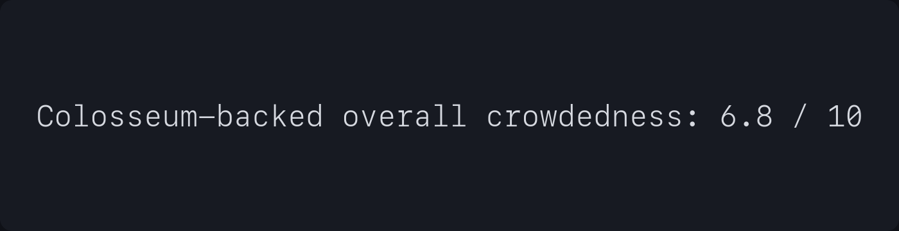

# Sivan Payment AI — Colosseum Crowdedness Score

Generated for the Superteam Earn Agentic Engineering Grant packet.

```txt
Colosseum-backed overall crowdedness: 6.8 / 10
```

## Interpretation

- **Overall crowdedness:** `6.8 / 10`
- **True Sivan wedge crowdedness:** `5.0 / 10`
- **Market gap score:** `7.6 / 10`
- **Build opportunity score:** `8.0 / 10`

The broader stablecoin payments and off-ramp category is moderately crowded, with existing projects across checkout, merchant payments, remittance, virtual accounts, x402 SDKs, and stablecoin infrastructure.

Sivan Payment AI’s narrower wedge is less crowded: an AI-assisted Solana payment operations layer combining stablecoin escrow, NGN off-ramp, virtual accounts, WhatsApp/Telegram workflows, x402 payments, admin reconciliation, alerts, and support automation.

## Grant-ready wording

> The broader stablecoin payments and off-ramp market is moderately crowded, around 6.8/10, with existing players across stablecoin APIs, virtual accounts, and fiat settlement. However, Sivan’s exact wedge is less crowded, around 5/10: an AI-assisted payment operations layer for Solana businesses that combines stablecoin escrow, NGN off-ramp, virtual accounts, WhatsApp/Telegram workflows, x402 payments, admin reconciliation, alerts, and support automation.

## Asset

Crowdedness score image:


