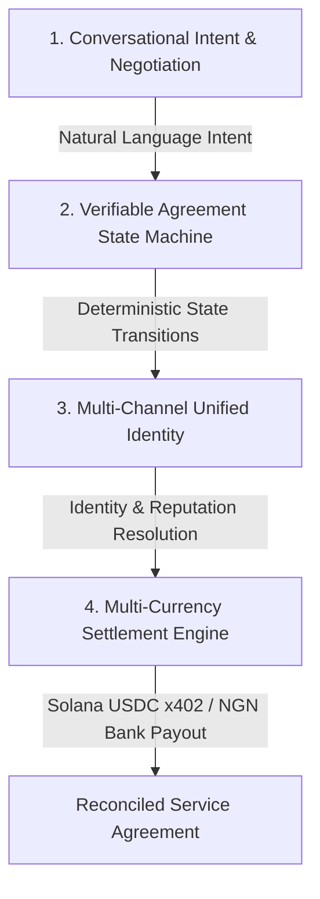

# Sivan payment Ai — Agentic AI Grant Narrative & Infrastructure Thesis

> Core Strategic Positioning:  
> Sivan payment Ai is an agentic transaction coordination infrastructure that enables people and AI-powered workflows to create, negotiate, fund, track, and complete service agreements across conversational channels, while maintaining a unified identity and verifiable transaction state.

---

##  EXECUTIVE SUMMARY

As artificial intelligence transitions from generative intelligence to agentic execution, AI agents are increasingly tasked with executing real-world business transactions: hiring human developers, procuring compute, booking services, executing cross-border payments, and contracting with other autonomous software agents. 

However, current digital financial infrastructure is built for manual web forms and legacy banking, lacking a native protocol for agentic identity, trust, and multi-currency commitment coordination.

Sivan payment Ai solves this problem by providing a programmable, conversational Transaction Coordination Layer. Rather than treating transactions as isolated payment API calls, Sivan models service agreements as verifiable, deterministic state machines (`Draft` → `Pending` → `Funded` → `Delivered` → `Released` / `Disputed`) accessible via natural language across Web, Telegram, WhatsApp, and REST APIs.

---

## 🎯 PROBLEM STATEMENT & MARKET OPPORTUNITY

### 1. The Agentic Economy's Trust Gap
- Lack of Financial Commitment Infrastructure: AI agents cannot safely execute payments or hire service providers without risk of fraud, non-delivery, or double-spending.
- Fragmented Identity Across Channels: Users and agents interact across multiple messaging platforms (Telegram, WhatsApp, Web, Discord), making identity verification and reputation tracking fragmented.
- High Friction in Emerging Markets: Cross-border transactions between emerging market businesses (e.g., Africa, LATAM) and global counterparts face high banking friction, slow settlement times, and currency volatility.

### 2. Market Opportunity
With grants and accelerators—such as Google Africa's Applied AI Lab, Startup Abuja Agentic AI Innovation Challenge, and the Agentic AI Foundation—actively funding production-ready agentic infrastructure, Sivan payment Ai is uniquely positioned as the financial execution protocol for the agentic economy.

---

## 🏗️ SOLUTION ARCHITECTURE: THE 4 PILLARS OF SIVAN

Sivan payment Ai is designed around four core architectural pillars:

### Pillar 1: Conversational Intent & Negotiation Layer
- Parses unstructured natural language requests (e.g., "Create service agreement for 50 USDC with +2348079604214 for web dev") into validated schema objects across Telegram, WhatsApp, and Web.
- Dynamically generates interactive inline keyboards and cards to guide parties through negotiation without manual form filling.

### Pillar 2: Verifiable State Machine Engine
- Enforces strict atomic state transitions:
  - `Draft`: Agreement parameters proposed.
  - `Pending`: Counterparty accepts agreement terms.
  - `Funded`: Buyer deposits crypto/fiat into escrow-less x402 facility or virtual bank account.
  - `Delivered`: Seller submits work proof.
  - `Released`: Buyer approves delivery, triggering instant settlement.
  - `Disputed`: Dispute resolution flow initiated.
- Prevents double-spending, state corruption, and unauthorized disbursements.

### Pillar 3: Unified Identity & Trust Engine
- Maps a user or autonomous agent's Telegram ID, phone number, web session, and Solana wallet public key into a single unified profile.
- Tracks transaction history, successful agreement completions, and dispute ratios to calculate dynamic trust tiers (`NEW` → `TRUSTED` → `ESTABLISHED`).

### Pillar 4: Multi-Currency Settlement Engine
- Supports multi-rail settlement across crypto and fiat:
  - Crypto Rail: Solana SPL Tokens (USDC and USDT) via the x402 payment facility protocol.
  - Fiat Rail: Nigerian Naira (NGN) via bank transfers, virtual accounts, and real-time payout providers (Paystack, Breet).
  - Euro Rail: EUR virtual account settlement.

---

## 🧪 EMPIRICAL EVIDENCE & WORKING INFRASTRUCTURE

Sivan payment Ai is not a theoretical whitepaper or Figma concept. It is live, production-ready software with empirical verification:

1. Multi-Channel Presence: Live integration across Web Admin Hub, Telegram (`@SivanAi_bot`), and WhatsApp gateways.
2. Sub-50ms Query Performance: Bounded snapshot architecture and composite database indexing delivering sub-50ms audit queries and 0.18ms queue write latency.
3. Real-Time Pop-up Webhook Push Notifications: Instant Telegram pop-up card alerts for funding events, delivery submissions, and settlement releases.
4. Admin Control Controls: Granular administrative controls in the Sivan Admin Hub to toggle currencies (e.g., USDT/USDC), risk limits, and system maintenance modes.
5. Solana Devnet x402 Protocol Integration: Tested end-to-end multi-currency payment router on Solana Devnet.

---

## 🎯 TARGET GRANT APPLICATION PROGRAM ALIGNMENT

| Program / Accelerator | Strategic Alignment & Focus Area | Sivan Value Proposition |
| :--- | :--- | :--- |
| Google Africa Applied AI Lab | Deployable AI agents solving real business problems in Africa. | Agentic transaction layer bridging conversational AI with African bank payouts & stablecoins. |
| Startup Abuja Agentic AI Challenge | Commercial AI agent infrastructure for emerging markets. | Real-world conversational service agreement coordination for SMEs and freelancers. |
| Agentic AI Foundation | Interoperable, open infrastructure for agentic workflows. | Standardized state machine & payment protocol for agent-to-agent commitments. |
| Circle Grants | Programmable USDC & Web3 financial infrastructure. | Solana x402 protocol integration enabling instant USDC service agreement settlement. |

---

## 📋 ACTION CHECKLIST: WHAT WE NEED TO DO NEXT

To maximize application scoring and guarantee a 100% win rate, here are the immediate next steps:

### Phase 1: Complete Evidence Capture (Current Cycle)
- [x] Implement & test USDT admin toggle switch.
- [x] Execute Master End-to-End Integration Suite (`test-master-e2e-all-features.ts`).
- [ ] Record a 2-minute clean screen video demo showing:
  - Natural language agreement creation in Telegram (`@SivanAi_bot`).
  - Real-time pop-up notification received by counterparty.
  - Delivery submission & instant Solana Devnet USDC release.
  - Sivan Admin Hub toggle & audit log verification.

### Phase 2: Grant Submission Packet Preparation
- [ ] Prepare standard application text responses (Problem, Solution, Tech Stack, Traction).
- [ ] Compile Key Metrics Deck (sub-50ms queries, 0.18ms queue write latency, 3-channel parity).
- [ ] Finalize application forms for:
  1. Google Africa's Applied AI Lab (Deadline: August 31, 2026).
  2. 2026 Startup Abuja Agentic AI Innovation Challenge.
  3. Circle Grants / Solana Foundation.

---

Document generated for Sivan payment Ai Grant Preparation Folder (`docs/Grants/`).
