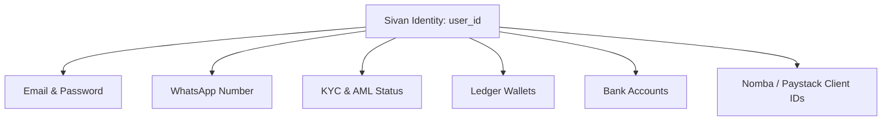

# Sivan AI Identity Architecture — Unified Cross-Channel Identity

This document defines the unified identity architecture for Sivan AI, detailing how user accounts are mapped, linked, and verified across WhatsApp and the Web Dashboard without using expensive SMS OTP.

---

## 1. Core Paradigm: Unified Identity

A user is defined by a single, permanent **Sivan User ID** (`user_id`). Individual communication channels, credentials, bank accounts, and integration records are simply *attributes* linked to this core identity.

This prevents account fragmentation, allowing users to start on WhatsApp and seamlessly access the web dashboard later (or vice versa) without losing their transaction history.

---

## 2. Low-Friction, Zero-Cost Account Linking

We do not use Twilio SMS OTP to link accounts. Because a message sent from WhatsApp is already verified by Meta/Twilio as belonging to that phone number, the message itself is cryptographic proof of ownership.

### Web to WhatsApp Linking Flow (QR / Prefilled Link)
1. **Initiate**: The logged-in Web user clicks **Settings ➜ Link WhatsApp** in their dashboard.
2. **Generate Token**: The backend creates a short-lived pairing token (e.g. `SVN-84KF-91` expiring in 10 minutes) mapped to their `user_id`.
3. **Direct User**: The web interface displays a QR Code and an **Open WhatsApp** button containing the prefilled link:
   `https://wa.me/<Sivan_Bot_Number>?text=SVN-84KF-91`
4. **Send Code**: The user clicks the button or scans the QR code, opening WhatsApp with the token pre-typed. They hit send.
5. **Attach & Clean**: Sivan AI bot receives the token, matches it to the pending `user_id` on the backend, updates the user's `whatsapp_number` field, deletes the token, and confirms via WhatsApp.

---

## 3. Reverse Linking: WhatsApp to Web
If a user starts on WhatsApp and wants to access the web panel:
1. **Trigger**: User types `Create web account` on WhatsApp.
2. **Email Prompt**: Sivan AI asks: *"What is your email address?"*
3. **Check Existence**:
   - **If Email is New**: Sivan creates a pending web profile, sends an email verification link, and binds the email to their existing `user_id` once verified.
   - **If Email Exists**: Sivan replies: *"We found an existing Sivan account with this email. Please log in on the Web Dashboard and approve this WhatsApp link under Settings."*

---

## 4. Bank Account Verification Role
Bank account name matches (e.g. Paystack/Nomba checks) are strictly utilized for **KYC and compliance verification**, never for account identity linking. A verified bank account name confirms deposit liability, but does not prove email or communication channel ownership.
